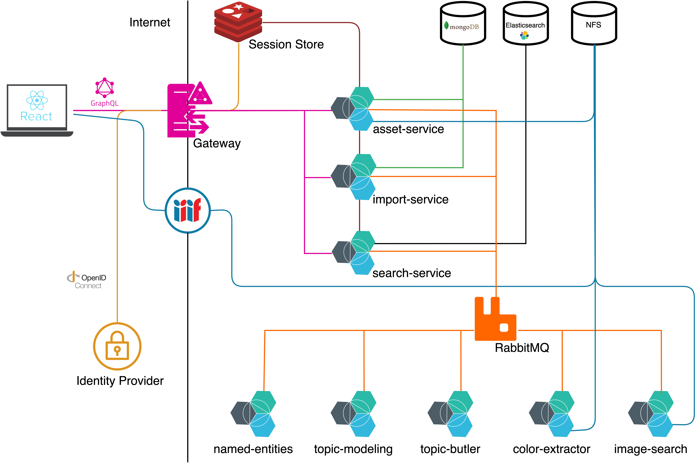
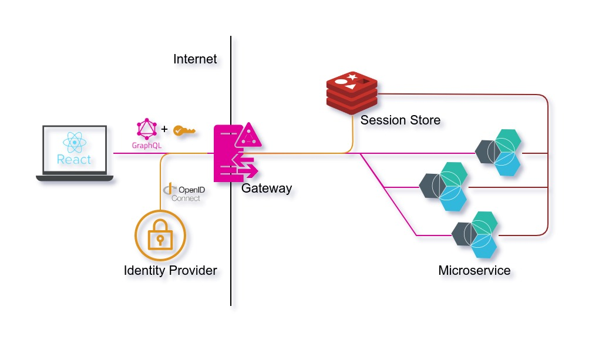
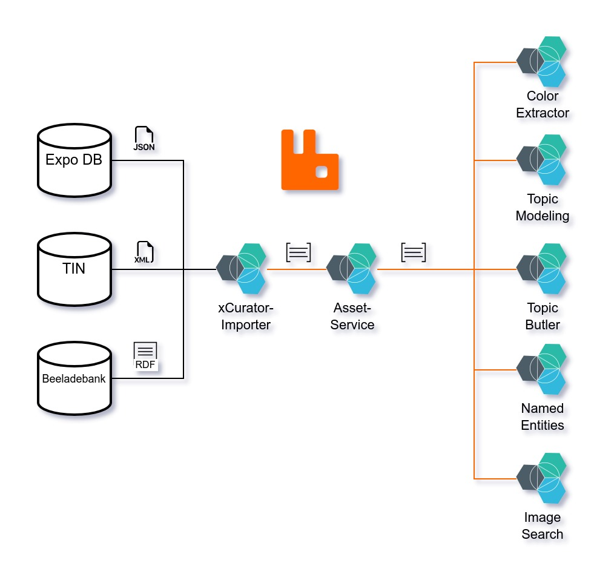

# xCurator 

- [Architecture](#architecture)
- [Data](#data)
- [Authentication](#authentication)
- [Import](#import)
- [Requirements](#requirements)

## Architecture
- **Frontend**: [React](https://reactjs.org/) | [TypeScript](https://www.typescriptlang.org/)
- **Backend**: [Java (LTS OpenJDK)](https://openjdk.org/) | [Spring Boot](https://spring.io/projects/spring-boot)
- **AI**: [Python](https://www.python.org/) | [Pytorch](https://pytorch.org/) 
- **Communication**: [RabbitMQ](https://www.rabbitmq.com/) | [Apollo GraphQL (Federation)](https://www.apollographql.com/docs/federation/)
- **Persistance**: [MongoDB](https://www.mongodb.com/)
- **Search**: [Elastic-Search](https://www.elastic.co/de/elasticsearch/)
- **Authentication**: [OpenID Connect](https://openid.net/connect/) | [KeyCloak](https://www.keycloak.org/)

The **xCurator** system has microservice architecture. The **IIIF Server** (serves image data) and the **Apollo GraphQL Gateway** (serves data graph) are exposed to the Internet.

The **Gateway** is responsible for handling all Client GraphQL requests, as well as authentication. The Gateway is storing the sessions inside a **Redis** storage which is available for all microservices with an GraphQL Sub-graph. 
The primary storage is a **MongoDB**. Second synced storage is the search engine **Elasticsearch**. All search requests are handled by the `search-service` which is connected to the search engine.
Extraction AI Services are connected via **RabbitMQ** message bus and only needed during the import of new data.



## Data

### Standards:
- Museum records: [LIDO](https://lido-schema.org/schema/v1.1/lido-v1.1.html)
- Image access URL: [IIIFv2](https://iiif.io/api/image/2.0/)

### Sources
1. [BLM](https://www.landesmuseum.de/museum) Expo DB | Digitaler Katalog
   - Import: iterative, synchronised through [REST API](https://expotest.bsz-bw.de/blm/digitaler-katalog/selekt?qry=text%20all%20%22Gold%22&len=5&fmt=lido)
   - ~ 17.000 Records (Museum Objects)

2. [AP](https://allardpierson.nl/en/) TIN
   - Import: static file (XML) | [BLM Nextcloud](https://cloud.landesmuseum.de/nextcloud/index.php/s/ww8KMjTGHME8zzX?dir=undefined&path=%2F01_Collection_Data%2FAllard%20Pierson%2FTIN%2FTIN&openfile=3749225)
   - ~ 759 Records (Museum Objects)
   
3. [AP](https://allardpierson.nl/en/) Beeldbank
   - Import: static files | [BLM Nextcloud](https://cloud.landesmuseum.de/nextcloud/index.php/s/ww8KMjTGHME8zzX?dir=undefined&path=%2F01_Collection_Data%2FAllard%20Pierson%2FBeeldbank%2FBeeldbank&openfile=3749224) 
   - More info: https://lod.uba.uva.nl/UB-UVA/Beeldbank/
   - ~ 25.000 Records (Museum Objects)

### Schema
```graphql
scalar URL # Spec: https://www.graphql-scalars.dev/docs/scalars/url
scalar Duration # Spec: https://www.graphql-scalars.dev/docs/scalars/duration
scalar DateTime # Spec: https://www.graphql-scalars.dev/docs/scalars/date-time
scalar Upload # Spec: https://github.com/jaydenseric/graphql-multipart-request-spec
scalar Latitude # Spec: https://www.graphql-scalars.dev/docs/scalars/latitude
scalar Longitude # Spec: https://www.graphql-scalars.dev/docs/scalars/longitude
scalar RGB # Spec: https://www.graphql-scalars.dev/docs/scalars/rgb
scalar HTML # Spec: https://datatracker.ietf.org/doc/html/rfc7992

type MuseumObject implements Node @key(fields : "id")   {
    id:ID!
    externalId:String!
    title: TextContent!
    description:TextContent!
    createdAt: DateTime!
    updatedAt: DateTime!
    keywords: [String!]!
    materials: [String!]!
    location: Location!
    techniques: [String!]!
    images: [Image!]!
    dateRange: DateRange
    topics: [MuseumObjectTopic!]!
}

type TextContent {
   content: String!
   entities: [NamedEntity!]!
}

type DateRange {
   name: String!
   start: DateTime
   end: DateTime
   epoch: String!
}

type Location   {
   name: String
   longitude: Float
   latitude: Float
}

type MuseumObjectTopic {
   id: ID!
   labels: [String!]!
   weight: Float!
}

type NamedEntity implements Node  @key(fields : "id") {
   id: ID!
   literal: String!
   type: EntityType!
   startPosition: Int!
   endPosition: Int!
   knowledgeBaseId: String # Contains Letter at the beginning
   knowledgeBaseUrl: String
   createdAt: DateTime!
   updatedAt: DateTime!
}

enum EntityType {
   ORG
   MISC
   PER
   LOC
}

type Story {
   id: ID!
   modules:  [Module!]!
   topics: [String!]!
}

type Module {
   id: ID!
   museumObject: MuseumObject!
}

type Image implements  Node  @key(fields : "id") {
   id: ID!
   description: AssetDescription
   externalIds: [ExternalIdentifier]!
   file: AssetFile!
   metadata: ImageMetadata
   ownerShip: AssetOwnerShip!
   previewUrl: URL
   project: Project! @provides(fields: "id") @shareable
   createdAt: DateTime!
   updatedAt: DateTime!
   colorInfo: ColorInfo!
}

type ImageMetadata  {
   XResolution: Int!
   YResolution: Int!
   colorSpace: String
   height: Int!
   orientation: ImageOrientation!
   primaryColor: RGB!
   width: Int!
}

enum ImageOrientation {
   LANDSCAPE
   PORTRAIT
}

type AssetDescription  {
   id: ID!
   title: String!
   shortAbstract: String
}

type ExternalIdentifier {
   "Identifier name. e.g. ISBN, UUID or WikidataID"
   name: String!
   "String representation of the Identifier value. e.g. '9783864907004' (ISBN)"
   identifier: String!
}

type AssetFile  {
   "Filename including extension"
   name: String!
   "File size in bytes"
   sizeInBytes: Int!
}

type AssetOwnerShip  {
   copyRight: String!
   creatorName: String!
   ownerName: String!
   provider: String!
}

type ColorInfo {
   # color palette of the image (without background colors)
   palette:  [Color]!
   # background colors
   background:  [Color]!
   # colors in the palette with a high saturation value
   shiny:  [Color]!
}

# RGB Color
type Color {
   # English color name
   name: String!
   # Amount of pixels in an image
   pixelCount: Int!
   # Ration of all pixels in an image related to the pixel count of this color.
   ratio: Int!
   # RGB Hexadecimal value of the color
   hex: RGB!
}
```
Additionally open-clip embeddings (dim: 640) are stored for the search.

#### Multingual Support

Textual content like title, description is saved with original text annotation and designed to support multiple languages. This part is crucial for the information extraction task, for instance Named Entities Recognition.  

The import service contains `translation` package that can be enabled for each textual content. The package uses [DeepL](https://www.deepl.com/translator). 

### Authentication

Authentication is done via OpenId Connect Standard. The central component is the **Gateway**, which is responsable for authentication creation and management of sessions.
Sessions are stored inside a **Redis** storage. For creating a new session we define the following Authentication Flow.

##### Authentication Flow
1. Users do a login through the Client (frontend) by inputing their credentials.
2. The Client App is doing a GraphQL Mutation (login) on the Apollo Gateway.
3. The **Gateway** using the user credentials for a Resource Owner Workflow.

      1. Combine user Credentials and Service Credentials (GraphQL Gateway Service).
      2. Request Access and Refresh Token on the Identity Provider.
4. Start a Session and store it inside **Redis** Session Storage.
5. Add Session Cookie on the Response Header (sid).

All requests afterwards include the cookie (sid) which can be used by all backend services to authenticate responses and read/write into the users sessions.




### Import
xCurator has three data sources. Expo DB, Tin dataset and the Beeldbank Dataset. An interface was written to ensure required methods for import job.
All datasets are imported through the `xcurator-import-service`. 
By enabling import flag, import sequence will begin on the next start of the service. 

#### Import Flow
For all data sources:
1. Request data endpoint and marshall the data into the internal data format.
2. Store all related images and records inside the database and publish creation events on the **RabbitMQ** message broker.
3. Creation Events trigger extraction services which are starting (batch) extraction.
4. Extraction Data will published on the message broker and fetched by the `asset-service` as well as the search service to fulfill the data.
5. The `asset-service` stores all the information inside the MongoDB.
6. The `search-service` stores all the information inside the Elasticsearch.

After the data is enriched by the extraction services, the extraction services can be shutdown. 



#### (AI-) Enrichment
- Color Extraction: Identify Background and Foreground Color Palette in a given Image (used for search).
- Embedding Extraction: image-search is extracting openCLIP empeddings of a input image. (used for search).
- Topic Modelling: titles and descriptions of the records are used for building a topic-model (20 topics, used for search).
- Entity Linking: titles and descriptions are used to perform entity recognition and entity linking with wikidata (used for highlighting and search).

### Requirements

#### Hardware requirements and rough cost estimation

To run the solution, following is required:

1. Kubernetes (usually ~70 Eur/month in clouds)
2. RAM/CPU/GPU:
  N.B., there are 2 distinctive modes of operation:
  - Serving the data
    - 4 CPU / 16 GB RAM (minimal requirements, usually ~120+ Eur/month in clouds)
    - NO GPU required
  - Infrequent batch import and process of dataset. Additional AI-processing services are being run, increasing requirements:
    - GPU IS required
    - 8-16 CPU / 40Gb RAM total
      - This translate to using additional node with GPU, 8-16 CPU and 32Gb RAM temporarily

Thus, during import process an GPU node should be used by Kubernetes cluster, providing extra GPU/CPU/RAM resources.
Example: a GPU node in clouds generally comes with sufficient CPU/RAM to cover these additional requirements, for example Azure Cloud, [Standard_NC16as_T4_v3](https://learn.microsoft.com/en-us/azure/virtual-machines/nct4-v3-series) has 16CPU, 110GB RAM, and costs 1,5$/hour).
Not all cloud platforms have GPU or support adding them to Kubernetes, however. Google and Azure for example, do.

Import process can last for few hours, depending on dataset size and GPU performance and CPU/RAM availability.
Example: during our internal tests on our hardware it took around 3 hours to process 40.000 files.

Depending on a cloud, GPU load may be automatically scaled up or down, using GPU node only when required, i.e. during import process only.
Very approximate cloud price for 1x GPU node per hour is 1.50+ Eur.

3. Storage requirements are sum of:
   - Minimum 50Gb for basic Kubernetes storage requirements, initial setup,
   - Storage, that depends on the size of dataset imported, can be calculated as 150% of actual data imported:
      - 100% is size of dataset
      - 10% is the data in MongoDB and ElasticSearch
      - 20% for backups
      - 20% for caches and reserve

Thus, 100Gb dataset witll result in `100Gbx1.5 + 50Gb = 200Gb`, and 500GB dataset will require `500Gbx1.5 + 50Gb = 800Gb`.
There are no special performance requirements for storage.
